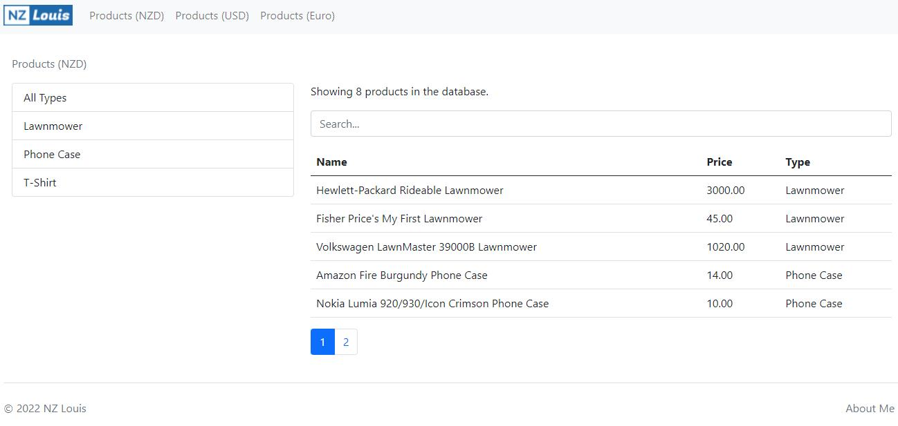

# products-react

This project includes many online react test questions that I have participated, including the posts comments system, the PIN Codes generation page, the products display page that the display in NZD, USD, and EUR. The Catalog Viewer shows the function of images switching, as well as other, react online test questions. By solving these problems, I got a job, and most importantly, my react ability has been greatly improved.

## Getting started

You can view a live demo over at https://products.nzlouis.com 

To get the frontend running locally:

- Clone this repo
- `npm install` to install all req'd dependencies
- `npm start` to start the local server (this project uses create-react-app)
- `npm test` to start the local testing
